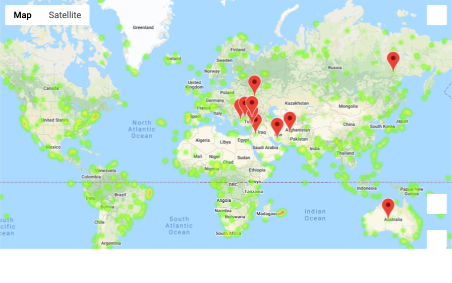

# python-api-challenge
Python APIs: use weather data from 500+ cities (from openweatherapi.org) to identify changes in temperature, humidity, wind speed, and cloudiness given a city's proximity to the equator.  Using Jupyter-gmaps and Google Places API, create a heat map displaying all cities with markers identifying ideal weather conditions for vacations (max temp between 70-80 degrees F, wind speed < 10mph, zero cloudiness).

The resulting map plot:

Notes to user for deployment:
*  your own Google Cloud Platform and Openweathermap.org API keys will be required into a file named 'api_keys.py' within the folder /WeatherPy.  More info below.
*  run these notebooks in Jupyter notebook, not in lab.  Geomaps apparently render better in jupyter notebook.

To protect API keys from being kept on the github site, they have not been included in this repository submission.

1. Google Platform
From your account on Google Platform, generate a new API key and enable the "Places API" and "Maps Javascript API"from the API library for this key.  It will be assigned to the "g_key" variable below.

2. OpenWeatherMap.org
From this site you will need to set up your own API key.  This key will be assigned to the 'weather_api_key' variable below.

Within this repository, you will need to create a file named 'api_keys.py' that will reside in the /WeatherPy folder.  The contents will be these two lines, where *** need to be replaced by your Google Platform API key and OpenWeatherMap.org API key respectively. Single quotes around the key strings are required.

g_key = '***'
weather_api_key = '***'
